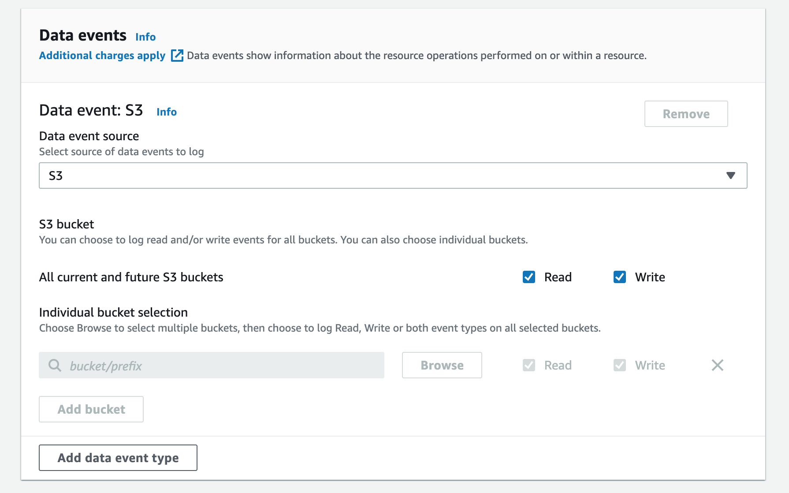
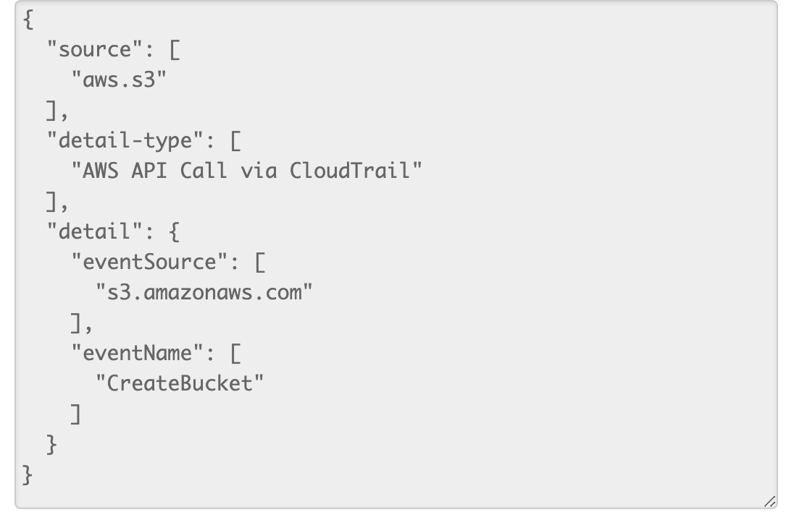
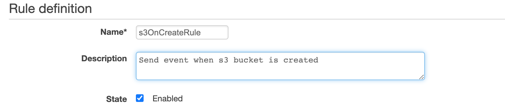
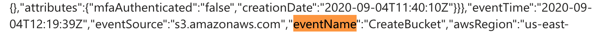

# lambda-onCreate-bucket
Procédure pour lancer une Lambda à la création d'un bucket. (Console)

## 1. Create a Lambda Function.

1.1 In the console go to Lambda service and select create function.

1.2 Choose Author from scratch and give a function name, for the runtime we will use python3.8. Then click on create.

1.3 You can type some code in the lambda function, for this example we will just return the event. Paste this code in the lambda editor.

```python
exports.handler = async (event) => {
    // TODO implement
    const response = {
        statusCode: 200,
        body: JSON.stringify(event)
    };
    return response;
};
```

Don't forget to click on save before continuing.

## 2. Create a trail to get s3 API Call events.

2.1 In the console go to CloudTrail and click on Trails at the left then create trail.

2.2 Give a name to your new trail and disable Log file SSE-KMS encryption, then click on Next.

2.3 Enable Management events and Data events then click next. 

Be sure to get the data event source from s3.



2.4 Review your trail configuration and click on create trail.

## 3. Create a CloudWatch event rule for s3 event.

3.1 In the console go to CloudWatch and click on Rules under the section Events then click on create rule.

3.2 Event pattern should be selected as default, in service name select s3 and in event type select Bucket level operation. A sub-section should appear, select Specific operations and add CreateBucket to it.

Your event pattern preview should be like that.



As we can see the "detail-type" is "AWS API Call via CloudTrail", s3 is a service that doesn't send events directly to CloudWatch but we can get them via CloudTrail (The trail we created previously).

3.3 On the target section you can add your lambda function and then click on configure details.

3.4 Give a rule name and description 



## 4. Visualize data with SNS

We can redirect the lambda result for visualization, here I will use SNS to send the result to my mail address when a bucket is created.

4.1 In the console go to SNS and create a new topic, let all the configuration to default.

4.2 On the left go to subscriptions and create a new one.

4.3 In topic ARN choose your previously created topic, for protocol choose Email and write your email in the field, then click on create subscription.

4.4 You will receive a confirmation mail, go to your mail box and confirm the subscription.

4.5 Finally go to your lambda function and add the SNS to topic as a destination.

Warning. By default the lambda function send result to SNS if it fails, when adding the SNS topic to target switch this parameter to On success.

## 5. Try it.

Create a new bucket and check your mail, you should receive a notification from AWS SNS.

If you look closely at the result you can see the eventName.




